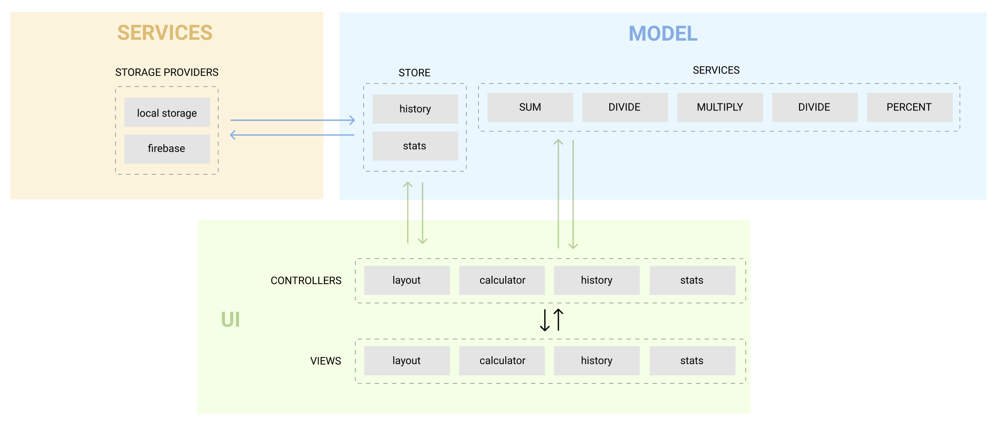

# IziPizi - You personal calculator

# [Veja em funcionamento aqui](https://giandanves.github.io/calculator)
Calculadora desenvolvida em Javascript. Após concluir suas funcionalidades, comecei a refazê-la em React, mas não a finalizei pois segui para outra aplicação em meus estudos. Para conferir minha primeira aplicação em React, visite meu outro repositório: [Pokédex](https://github.com/giandanves/pokedex)

## Leveraging the architecture

[View in figma](https://www.figma.com/file/J7ymhrHDASUOpXp2jHO2Dh/Architecture-chart)

This architecture above is inspired by the [MVC](https://pt.wikipedia.org/wiki/MVC) (Model, View, Controller) pattern. And each view, model, service and controller
must follow the [SOLID](https://pt.wikipedia.org/wiki/SOLID) principles.

### Views

Views are modules that take care of rendering the interface and listening to user-generated events. Views communicate with controllers.

### Controllers

Controllers serve as a bridge between the user interface (Views) and the business logic (Model). Controllers communicate with views and models.

### Models

Models are modules that take care of executing business logic, based on user input, received by controllers. Some Models also have the responsibility to save and retrieve data from storage.

Executing business logic AND dealing with storage would break the S principle of SOLID: Single responsibility. That's why Models need to communicate with storage services.

Models communicate with services and controllers
